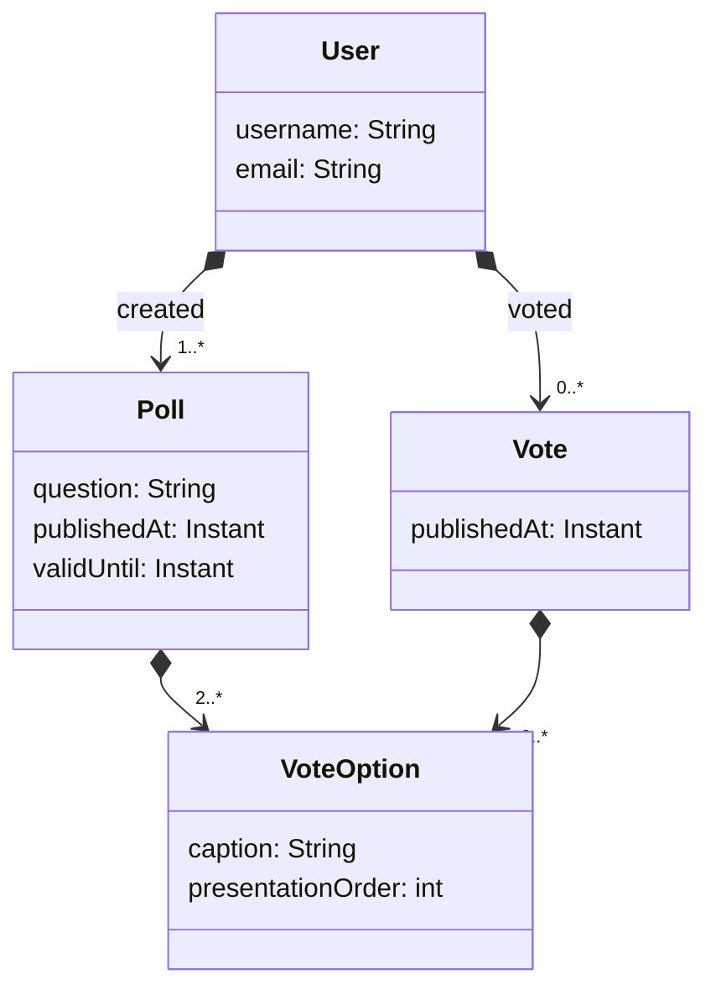
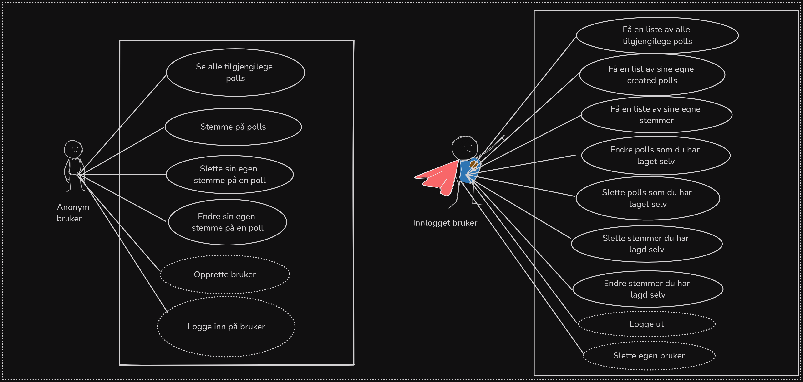

# DAT250 - FeedApp Project
## Tech stack
For the tech stack we have chosen to use:
- Relational database: PostgreSQL
- NoSQL: MongoDB
- Message broker: RabbitMQ
- Backend: Spring
- Frontend: Vue (Extra technology)
- Security: Spring Security
- Container engine: Docker
- CI pipeline: Github actions
- Build tool: Gradle
## Class Diagram

## User stories

## Authors
- [Sondre Gjellestad](https://github.com/sondregj)
- [Vebjørn Fjeldstad](https://github.com/602822)
- [Jonas Vestbø](https://github.com/h598999)
- [Andreas Søland Henriksen](https://github.com/andreashenriksen)
